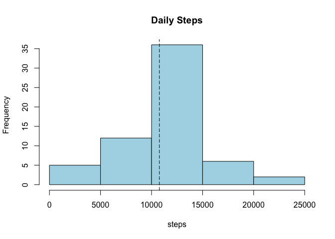

# Reproducible Research: Peer Assessment 1

## Libraries used

```r
library(dplyr)
library(lattice)
```

## Loading and preprocessing the data

Unzip, load the data and delete rows with missing values


```r
data <- read.csv(unz("activity.zip","activity.csv"), na.strings="NA",
                 colClasses=c("integer","Date","integer"))

activity <- data %>% filter(!is.na(steps))
```

## What is mean total number of steps taken per day?

Build a daily activity data frame summarizing the number of steps per day,
and compute the media and median of the daily summaries.


```r
daily <- activity %>% group_by(date) %>% summarise(steps=sum(steps))
dmean   <- mean(daily$steps)
dmedian <- median(daily$steps)
```

The mean total number of steps per day is: 10766.1887 and 
the median is 10765.0000.


```r
hist(daily$steps, col="light blue", main="Daily Steps", xlab="steps")
abline(v=dmean,lty='dashed')
abline(v=dmedian,lty='dotted')
```

 

## What is the average daily activity pattern?

Build a data frame with the mean of the number of steps by interval, and compute
the most active interval which should yield a one row data frame.


```r
iactv <- activity %>% group_by(interval) %>% summarise(steps=mean(steps))
most_active_interval = iactv %>% filter(steps==max(steps))
```

The most active interval is: 835 with a mean of
206.1698 steps.

The following shows the average daily activity pattern, with the most
active interval highlighted in red.


```r
with(iactv, plot(x=interval, y=steps, type="l"))
abline(v=most_active_interval[1,1],lty='dashed', col="red")
title(main="Daily activity pattern",sub="with most active interval")
```

 


## Imputing missing values

There are a total of 2304 missing values in the database.

To avoid bias in the calculations fill in the missing values.

The strategy will be to use the mean of the interval through the days to fill in
the not available values.


```r
fill_in1 <- filter(data,is.na(steps)) %>% inner_join(iactv,by="interval") %>%
  select(steps=steps.y, date, interval) %>% rbind(activity)
```

Build a daily activity data frame summarizing the number of steps per day,
and compute the media and median of the daily summaries, for the fill in data.


```r
daily1 <- fill_in1 %>% group_by(date) %>% summarise(steps=sum(steps))
dmean1   <- mean(daily1$steps)
dmedian1 <- median(daily1$steps)
```

The mean total number of steps is: 10766.1887 and the median is 10766.1887.


```r
hist(daily1$steps, col="light blue", main="Daily Steps", xlab="steps")
abline(v=dmean1,lty='dashed')
abline(v=dmedian1,lty='dotted')
```

 

## Are there differences in activity patterns between weekdays and weekends?

Build weekday factor, notice that strftime is used to get the days as numbers
in the range 0 to 6 where 0 = sunday, this is to avoid locale issues with 
weekday() which returns the day names in current locale.


```r
weekday <- as.integer(strftime(fill_in1$date,"%w"))
weekday <- factor(weekday == 0 | weekday == 6, labels=c("weekday","weekend"))
```

Add the weekday and summarise using the mean of steps in dwactiv.


```r
dwactiv <- fill_in1 %>% 
  mutate(weekday) %>%
  group_by(weekday,interval) %>%
  summarise(steps=mean(steps))
```

Differences in activity patterns between weekdays and weekends are shown in
the following graph.


```r
xyplot(steps ~ interval | weekday, data = wactiv, layout=c(1,2), type="l")
```

 

