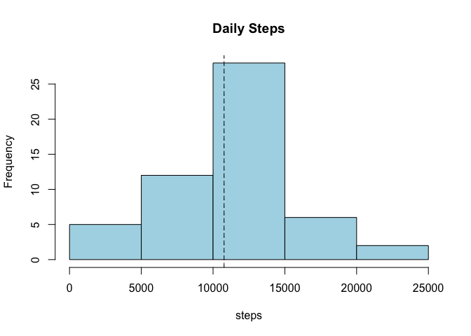
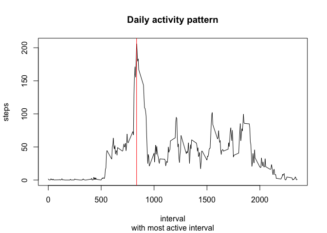
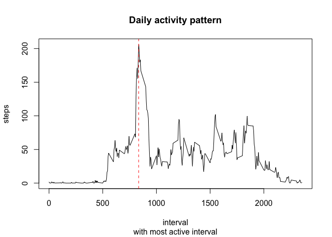
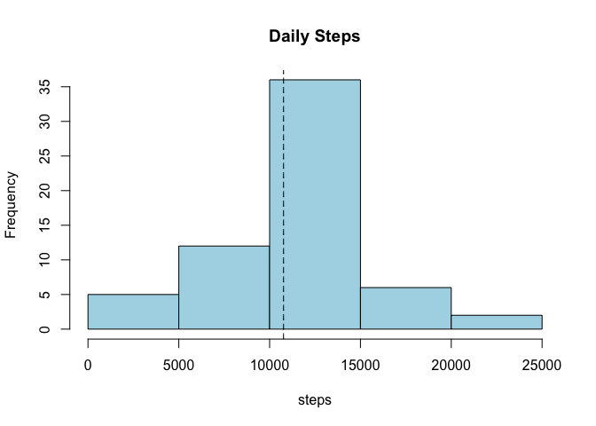

# Reproducible Research: Peer Assessment 1

## Libraries used

```r
library(dplyr)
library(lattice)
```

## Loading and preprocessing the data


```r
data <- read.csv(unz("activity.zip","activity.csv"), na.strings="NA",
                 colClasses=c("integer","Date","integer"))

activity <- data %>% filter(!is.na(steps))
```

## What is mean total number of steps taken per day?


```r
daily <- activity %>% group_by(date) %>% summarise(steps=sum(steps))
dmean   <- mean(daily$steps)
dmedian <- median(daily$steps)
hist(daily$steps, col="light blue", main="Daily Steps", xlab="steps")
abline(v=dmean,lty='dashed')
abline(v=dmedian,lty='dotted')
```

 

The mean total number of steps is: 10766.1887 and the median is 10765.

## What is the average daily activity pattern?


```r
iactv <- activity %>% group_by(interval) %>% summarise(steps=mean(steps))
most_active_interval = iactv %>% filter(steps==max(steps))
with(iactv, plot(x=interval, y=steps, type="l"))
abline(v=most_active_interval[1,1],lti='dashed', col="red")
```

```
## Warning in int_abline(a = a, b = b, h = h, v = v, untf = untf, ...): "lti"
## is not a graphical parameter
```

```r
title(main="Daily activity pattern",sub="with most active interval")
```

 

The most active interval is: 835 with a mean of 206.1698113 steps.

## Imputing missing values

There are a total of 2304 missing values in the database.

To avoid bias in the calculations we're going to fill in the missing values using the mean of the missing data interval.

### Fill in NA values using interval mean


```r
fill_in1 <- filter(data,is.na(steps)) %>% inner_join(iactv,by="interval") %>%
  select(steps=steps.y, date, interval) %>% rbind(activity)
```


```r
daily1 <- fill_in1 %>% group_by(date) %>% summarise(steps=sum(steps))
dmean1   <- mean(daily1$steps)
dmedian1 <- median(daily1$steps)
hist(daily1$steps, col="light blue", main="Daily Steps", xlab="steps")
abline(v=dmean1,lty='dashed')
abline(v=dmedian1,lty='dotted')
```

 

The mean total number of steps is: 10766.1887 and the median is 10766.1887.

## Are there differences in activity patterns between weekdays and weekends?

Add weekdays as a factor, notice that I have used strftime to get the days as characters 0 to 6
where 0 = sunday, this is to avoid protability problems due to locale settings.


```r
# Compute weekday factor
weekday <- sapply( strftime(fill_in1$date,"%w"), function(x) if (x==0 | x == 6) {"weekend"} else {"weekday"} )
wactiv <- mutate(fill_in1, weekday = as.factor( weekday )) %>% group_by(weekday,interval) %>% summarise(steps=mean(steps))
```

The following graph shows the activity difference between weekdays and weekends


```r
xyplot(steps ~ interval | weekday, data = wactiv, layout=c(1,2), type="l")
```

 

